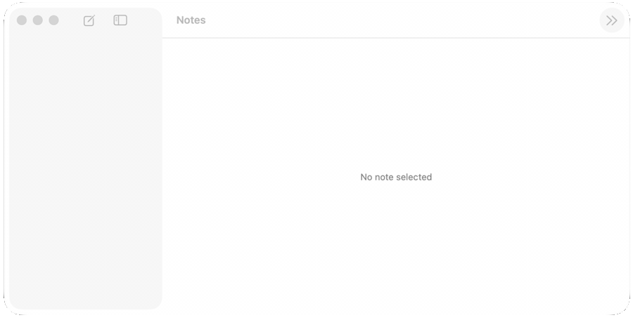

# offstage

**An agent tests your Mac app in about a second, in the background, and
checks the app's real state instead of a screenshot.**

Computer-use agents can already click through your app. They take 45 seconds
to do a ten-step journey, they take over your screen while they do it, and
one run in three got it wrong and reported success anyway. offstage runs the
same journey in 1.15 seconds, behind your other windows, and verifies against
what the app actually saved.



*One `batch` call, 25 steps: five notes added, five renamed, two reordered,
one deleted from the menu, another added, and nine checks against the app's
saved state along the way. Recorded through ScreenCaptureKit while the
window sat behind other windows. Short pauses were added between steps so
you can follow; without them the 25 steps take 1.5 s.*

## How it is that fast

A screenshot agent pays for an image on every step and guesses from pixels.
offstage skips the screen:

- It reads the app's accessibility tree instead of looking at pixels.
- It presses buttons and menus through the accessibility API, which works on
  background windows.
- It verifies against the app's own saved state, so "the window looks right"
  is never the answer.

The same journey, three ways:

| arm                     | wall clock | screen  | wrong runs |
| ----------------------- | ---------- | ------- | ---------- |
| screenshot agent        | 44.7 s     | taken   | 1 of 3     |
| XCUITest                | 54.5 s     | taken   | 0          |
| offstage `batch`        | 1.15 s     | yours   | 0 of 5     |

Works with Claude Code, Codex, or a plain shell script. Numbers and what they
leave out: [docs/benchmarks.md](docs/benchmarks.md).

## Try it in two minutes

```sh
pip install offstage
offstage probes build       # compile the Swift probes (one-time)
offstage doctor             # check session, permissions, toolchain
```

Build the bundled fixture app, then drive it:

```sh
cd examples/NotesApp && xcodegen generate
xcodebuild -project NotesApp.xcodeproj -scheme NotesApp -configuration Debug \
  -derivedDataPath /tmp/offstage-nb-dd build
cd ..

offstage start notesapp.manifest.json
offstage press notesapp.manifest.json addNote
offstage observe notesapp.manifest.json
offstage stop notesapp.manifest.json
```

Then hand it to your agent:

```sh
offstage skill install       # teaches Claude Code the workflow and the rules
```

Claude Code can also install it as a plugin:

```
/plugin marketplace add thesepehrm/offstage
/plugin install offstage-qa@offstage
```

No skill mechanism? Paste
[skills/offstage-qa/SKILL.md](skills/offstage-qa/SKILL.md) into your
`AGENTS.md`.

---

## For the nerds

Everything below is how it works and what was measured.

### Four channels, one refusal

```
┌────────────┐   press / menu (AXPress)   ┌──────────────────┐
│  offstage  │ ─────────────────────────▶ │  app under test  │
│   driver   │   port (line-JSON/UNIX)    │   (background,   │
│            │ ─────────────────────────▶ │  never frontmost)│
│            │ ◀───────────────────────── │                  │
└────────────┘   AX tree · SCK pixels ·   └──────────────────┘
                 UserDefaults ground truth
```

| channel          | what the agent gets                                                   |
| ---------------- | --------------------------------------------------------------------- |
| **structure**    | accessibility tree as compact text (`observe`)                        |
| **pixels**       | ScreenCaptureKit captures, canonical-state golden diffs (`golden`)    |
| **control**      | `AXPress` for buttons and menus, a semantic port for typing and drags |
| **ground truth** | the app's persisted state, so verification never trusts the UI        |

The one refusal: no synthetic keyboard or mouse events. Those land in
whatever window is frontmost, including yours. What each channel can and
can't do: [docs/channels.md](docs/channels.md).

### Why not a computer-use agent

A screenshot-driven agent needs the foreground, so it can't run while you
work, and every observation costs an image.

Same journey, both ways: two notes, two renames, a menu delete, verified at
each step. A model driving screenshots and clicks took a median 44.7 s over
3 runs. The same journey as one offstage `batch` call took 1.15 s over 5.

One of the three agent runs deleted both notes instead of one. It could not
tell from pixels that its first menu click had already landed, so it clicked
again, and it finished reporting success. Persisted state said `[]`.

That is the argument, more than the 39x. A screenshot agent's failure mode is
a confident wrong answer, because the only thing it can check is whether the
window looks right. Reading the app's own state turns that into a mismatch.

Also measured, on seeded-defect apps:

- Equal or better defect recall, at 3.6x to 28x fewer observation tokens.
- Smaller models degrade less on text than on screenshots.
- Scripted batteries catch 13/13 and 8/8 seeded defects in ~9 s, 0 tokens.

Full tables, including what the 39x understates and overstates:
[docs/benchmarks.md](docs/benchmarks.md).

### Why not XCUITest

XCUITest takes the machine too. It brings the app under test to the
foreground and synthesizes events, so a run and your typing can't share a
desktop.

It also wants a compiled test target. Every new check is a code change, a
rebuild, and a `xcodebuild test` cycle. An agent mid-conversation can't add
one step and see the result.

Same NotesApp journey, warm derived data, nothing to compile: `xcodebuild
test` takes 54.5 s, of which 5.5 s is the passing test case and the rest is
xcodebuild starting, the runner attaching, and the app launching. The
offstage `batch` call is 1.15 s.

offstage is the ad-hoc counterpart: one CLI call per step, no test target,
against a running app that stays in the background. Keep XCUITest for the
suite you commit. Use offstage for the exploratory pass and for checks an
agent writes on the spot.

### The verbs

| verb                           | does                                              |
| ------------------------------ | ------------------------------------------------- |
| `start` / `restart` / `stop`   | launch fresh, relaunch without reset, quit        |
| `press <id>` / `menu <m> <i>`  | AXPress a button or menu item                     |
| `port '<json>'`                | semantic action: typing, tabs, drags              |
| `observe`                      | AX rows, persisted state, port state, a11y counts |
| `golden check` / `golden bake` | canonical-state pixel diff, or rewrite goldens    |
| `batch <steps>`                | a whole journey in one call (below)               |

### Run journeys with `batch`

One CLI call costs an agent one turn, so a ten-step journey costs ten.
`batch` runs the list in one process and returns one JSON result.

```sh
offstage batch notesapp.manifest.json '[
  ["start"],
  ["press","addNote"],
  ["expect","/defaults/notes.v1/0/title","\"Untitled\""],
  ["port","{\"cmd\":\"rename\",\"index\":0,\"title\":\"TOP\"}"],
  ["expect","/port/titles","[\"TOP\"]"]]'
```

`expect` takes an RFC 6901 pointer into `{defaults: the persisted store,
port: the port's state reply}`. It reads ground truth, not the actuation
echo, so the result is pass/fail instead of a dump to interpret.

Steps can also be a `.json` file or `-` for stdin. Exit status is 1 when a
step fails. Batching that journey: 1 turn instead of 12, ~340 tokens instead
of ~2000.

### Your own app

1. Write a manifest: [docs/manifest.md](docs/manifest.md).
2. Embed the port in debug builds: [swift/OffstagePort](swift/OffstagePort).
3. Crystallize the journeys worth keeping as `batch` step files, or as a
   battery script ([bench/](bench/)) when they need conditionals.

From a clone: `pip install -e '.[dev]'`.

### Host requirements

- macOS 15+ (measured on 26.1), Xcode command-line tools, `xcodegen` for the
  example apps.
- Unlocked screen, display awake. Use `caffeinate -du` for long runs. The
  driver refuses to run into a locked session, because the channels degrade
  silently.
- Accessibility and Screen Recording permission for the host terminal. Both
  are one-time manual grants that nothing can automate, including CI.

### Limits

No synthetic input on a shared desktop. No background typing into SwiftUI
fields, where AX set-value looks like it works but the store never changes.
Goldens are byte-exact on the same machine only.

Full list, with the failure behind each rule:
[docs/limits.md](docs/limits.md).

### Repo layout

| path                   | what                                                        |
| ---------------------- | ----------------------------------------------------------- |
| `src/offstage/`        | Python driver + CLI (`offstage`), manifest validator        |
| `src/offstage/probes/` | single-file Swift probes (AX, SCK, pixdiff, session lock)   |
| `swift/OffstagePort/`  | Swift package: the semantic port apps embed in debug builds |
| `skills/`              | agent skill (Claude Code plugin layout)                     |
| `examples/`            | two fixture apps (NotesApp, ConvertApp) + manifests         |
| `bench/`               | deterministic probe batteries (= integration tests)         |
| `docs/`                | channels, benchmarks, limits, manifest reference            |

### Provenance

Extracted from a private research program on agentic macOS QA: channel
measurement, perception ablations, seeded-defect benchmarks. Where a rule
looks oddly specific, violating it broke a run.

## License

MIT. See [LICENSE](LICENSE).
